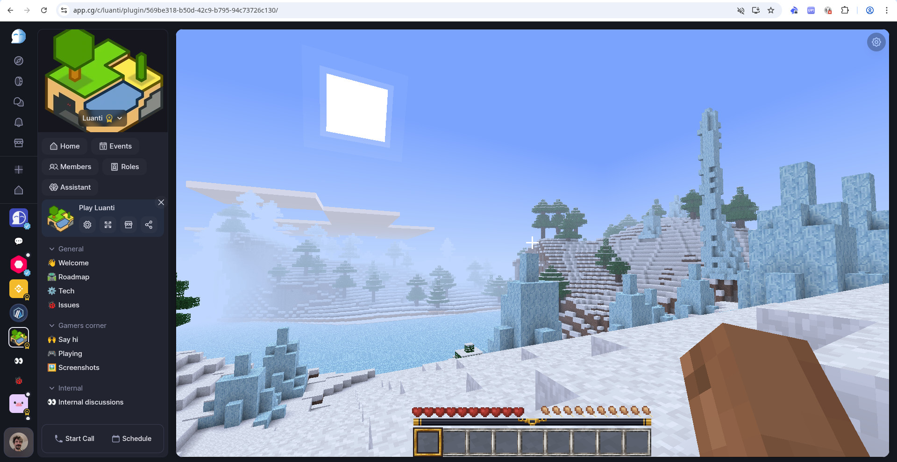
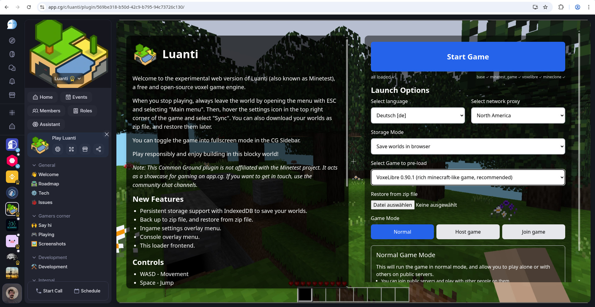
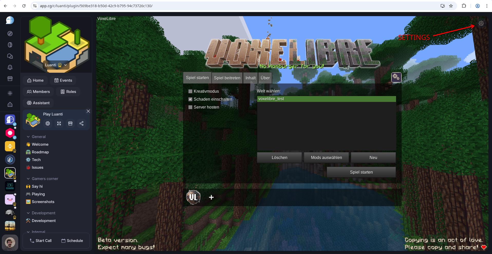
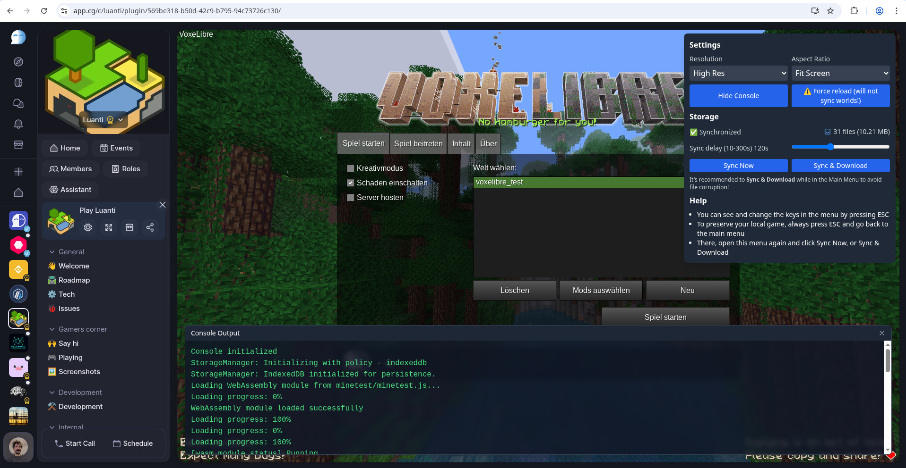

Minetest-wasm
=============

This is an experimental port of Minetest to the web using emscripten/WebAssembly.

The original repository was made by paradust7. This fork has done some work on save game persistence through 
indexeddb storage, and has been created as a proof of concept for embedding a minecraft-like game into 
the social platform Common Ground ([app.cg](https://app.cg), [commonground.cg](https://commonground.cg)) as an in-community plugin, to enable full p2p gameplay. 
The game server can be hosted in the browser, with persistent save games in indexeddb, zip file backup and restore, and more.

There's an inofficial [Luanti Community](https://app.cg/c/luanti) there, where the game can be played, and development and 
roadmap of this repository can be discussed.

### Status of this repository

This build does not use the latest version of Luanti (5.9 vs 5.13), and not much has been updated in the web assembly 
build pipeline. Anyone who is interested in working on this together is very welcome. Update: paradust has recently started
to work on updating to the latest Luanti version.

Disclosure: I'm also one of the founders of the Common Ground project, which is [on github](https://github.com/Common-Ground-DAO) too.

List of features (updated 2025-08-25):
- Replaced the original html loader with a modern React based loader. This allows easy integration and customization of Luanti Web into existing websites.
- Loader has many configuration options and comes with pre-loaded game packs to choose from. (screenshots at the bottom).
  - Luanti can also access contentDb and online play (made possible by paradust).
- In-browser storage backend for world save and config files. This allows save games to be stored persistently in the browser across reloads.
- With this indexedDb storage backend, the Luanti web client can be embedded and run in cross-origin iframes. This is convenient, as it allows better integration in existing web projects.
- Added Backup and Restore function for all Worlds saved in the browser. They can now be saved and restored as local zip files.
- Added an Ingame Settings overlay (hoverable cogwheel in top right corner), where synchronization, backups and some other settings can be managed.
- The original repo only comes with minetest_game, which is a bit underwhelming. Since I wanted to showcase a cool game integration, I switched that for VoxeLibre which now comes pre-loaded as the default game. I just updated it to the most recent version, too (0.90.1 as of today). Also added Mineclonia (0.116.1) but it currently fails with a LUA error.

Update 2025-08-10:
- I've connected with paradust, the maintainer of the repository this one has been forked from
- There's a [Discord community](https://discord.gg/APmB9j2M) for Luanti WASM now, for development related discussions, feedback, feature requests etc.
- You're still invited to join the inofficial [Luanti community on app.cg](https://app.cg/c/luanti) if you want to get in touch
- I will try to upstream my storage changes to the original repository
- At the same time, I consider making an app.cg-specific branch that connects the Luanti client with CG's user and community model, to enable a customized, community-integrated gameplay experience

Update 2025-08-25:
- paradust has done some recent work on their repository. I created the branch `wip/merge_upstream` where I merge those changes, but as of today,
the Luanti version is still the same, so there's no benefit in switching yet. The update process is expected to take a while.

### Local Development and Deployment

For building and serving Luanti Web, there are multiple scripts. Everything is dockerized, so it should run 
on most systems. I only test it on Linux though 🐧❤️.

Build results (Luanti + loader) will be combined production-ready in `www/`. Serving it needs a specific header 
setup though (see Running in an iframe / standalone).

`build_all_with_docker.sh` will build the Luanti codebase with emscripten, and will internally run all 
the other build scripts in a docker container. It will also build the React Frontend which is located in `app/`,
the full build ready to serve on a webserver will be available in `www/`.

`update_build_static.sh` will only build the React Frontend and update the build in `www/`. It uses the Luanti 
which has already been built by `build_all_with_docker.sh`, so this needs to run at least once before. 
This script is used if you only made changes to the loader UI and don't need to rebuild Luanti (which takes much
longer than the web frontend).

I also added a local nginx server that you can use to host the game at localhost:8080. You can run it with 
`./serve_www_with_nginx.sh` (after building). It serves the `www` directory and applies the correct header setup 
that is required for Luanti Web to run correctly. You can check the header setup in `nginx/nginx.conf`, and 
you'll find web server logs in `nginx/logs/`.

**Notes**

Make sure that the user runs `./build_all_with_docker.sh` also owns the project folder. This script (and `app/docker.sh` which it calls) mounts the project folder to docker and also run as the user who calls the script. This normally means your user needs to be added to the docker group.

The docker build pipeline generates two auxiliary docker images: `minetest_builder` and `minetest_app_builder`. Each of them will build one component of the actual app, but if you build them with the wrong user (e.g. root), be aware you will run into issues:

- If your try to build with sudo, you might end up with broken container images because npm cache permissions can end up incorrect
- The repository folder must be owned by the build user, who has to be added to the `docker` group
- If you end up with broken build containers, you can always clean them up with `docker image rm minetest_app_builder && docker image rm minetest_builder`. The next build will re-create them.

**Other**

I've also added some patches to hook into the saving to disk process, to trigger a synchronization with 
indexeddb right after the save. My specific use case (cross-origin iframes: Embed Luanti web anywhere) only 
works with indexedDb, but I might look into FileSystemDirectoryHandle to enable a direct local sync directory.

### Hosting for running in an iframe

If you want to embed this Luanti Web build as an iframe, the outer page as well as the iframed page need to set the following headers:

Outer page:
- Cross-Origin-Embedder-Policy require-corp
- Cross-Origin-Opener-Policy same-origin

Inner page (in iframe):
- Cross-Origin-Embedder-Policy require-corp
- Cross-Origin-Opener-Policy cross-origin
- Cross-Origin-Resource-Policy cross-origin (only required on resource files)

### Hosting for running standalone

If you want to run Luanti Web on a standalone domain, you need the following header setup:

- Cross-Origin-Embedder-Policy require-corp
- Cross-Origin-Opener-Policy same-origin
- Cross-Origin-Resource-Policy same-origin

### Update history

2025-08-25 Update Notes

- reworked launcher UI:
  - updated button order and element layout
  - added game pack preload selection: VoxeLibre 0.90.1, Mineclonia 0.116.1, Minetest Game
  - adjusted introduction texts
- world backups can now be downloaded as zip files, and also restored from zip files
- added a docker nginx server for local development
- the synchronization interval / debounce duration are now configurable
- added more game packs

2025-08-10 Update Notes

- reworked the indexedDb sync mechanism, so it reliably synchronizes all world files and folders, with a configurable debounce interval
- automatic world tracking: only synchronizes the currentl active world
- added minetest.conf and client/mod_storage.sqlite to sync
- updated VoxeLibre in the build pipeline to the most recent version (0.90.1)
- This repository is LGPLv2.1-licensed, since it contains some files copied from Luanti

### More screenshots

=============

Original README
-------------------

The original README is partially deprecated, use with caution.

System Requirements
-------------------
This has only been tested on Ubuntu 20.04.

* Ubuntu: apt-get install -y build-essential cmake tclsh

Building
---------

    cd minetest-wasm
    ./build_all.sh

Installation
------------

If the build completes successfully, the www/ directory will contain the entire application. This 
includes an `.htaccess` file which sets headers that are required (by browsers) to load the app. 
If your webserver does not recognize `.htaccess` files, you may need to set the headers in
another way.

Network Play
------------

By default, the proxy server is set to `wss://minetest.dustlabs.io/proxy` (see static/launcher.js).
This is necessary for network play, since websites cannot open normal TCP/UDP sockets. This proxy
is located in California. There are regional proxies which may perform better depending on your
location:

North America (Dallas) - wss://na1.dustlabs.io/mtproxy
South America (Sao Paulo) - wss://sa1.dustlabs.io/mtproxy
Europe (Frankfurt) - wss://eu1.dustlabs.io/mtproxy
Asia (Singapore) - wss://ap1.dustlabs.io/mtproxy
Australia (Melbourne) - wss://ap2.dustlabs.io/mtproxy

You could also roll your own own custom proxy server. The client code is here:

https://github.com/paradust7/webshims/blob/main/src/emsocket/proxy.js

Custom Emscripten
-----------------
The Emscripten SDK (emsdk) will be downloaded and installed the first time you build. To provide
your own instead, set $EMSDK before building (e.g. using `emsdk_env.sh`). An external Emscripten
may need to be patched by running this exactly once:

    ./apply_patches.sh /path/to/emsdk
